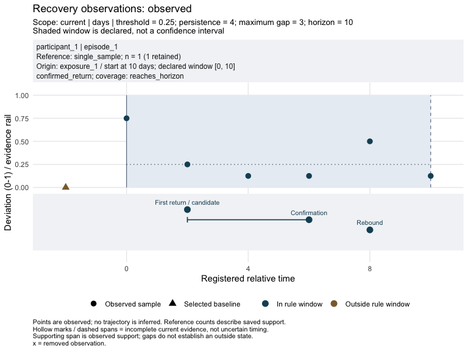

<!-- README.md is generated from README.Rmd. Please edit README.Rmd. -->

# recoverome

[](https://lifecycle.r-lib.org/articles/stages.html#experimental)
[](https://github.com/xec-cm/recoverome/actions/workflows/check-bioc.yml)

**Describe microbiome return to a personal baseline under an explicit
observation rule.** Keep references, deviations, episode outcomes and
provenance in a TreeSummarizedExperiment (TSE). Similarity to baseline
does not establish health or continuous recovery between visits.

## Install

The experimental development branch requires R \>= 4.6.0. Version
`0.99.0` is an MVP and submission candidate, not a CRAN or Bioconductor
release.

``` r
install.packages("remotes")
remotes::install_github("xec-cm/recoverome", ref = "devel")
```

## A complete example

One participant, one explicit baseline (`b1`) and six follow-up visits.
This bundled synthetic example runs offline. Rule values are
illustrative, not recommended biological cutoffs.

``` r
data("recovery_examples", package = "recoverome")
example_data <- recovery_examples$observed_recovery
raw <- TreeSummarizedExperiment::TreeSummarizedExperiment(
  assays = list(counts = example_data$counts),
  colData = S4Vectors::DataFrame(example_data$col_data)
)
tse <- recoverome::setup_recovery(
  raw,
  analysis_id = "observed",
  episodes = example_data$episodes,
  events = example_data$events,
  time_col = "day",
  time_unit = "days",
  time_origin = "days since enrolment"
)
tse <- recoverome::add_reference(tse, "observed", reference = "b1", assay = "counts",
                     preprocessing = "synthetic counts; no upstream transformations")
tse <- recoverome::add_deviation(tse, "observed")
rule <- list(threshold = 0.25, persistence = 4, max_gap = 3, horizon = 10)
tse <- recoverome::add_recovery(tse, "observed", rule)

as.data.frame(recoverome::recovery_results(tse, "observed"))[, c(
  "status", "candidate_time", "confirmation_time", "rebound_time"
)]
#>             status candidate_time confirmation_time rebound_time
#> 1 confirmed_return              2                 6            8
```

Return is observed on day **2**, confirmed by observations through day
**6**, and followed by a rebound on day **8**. Confirmation is not
permanent recovery.

``` r
recoverome::plot_recovery(tse, "observed")
```



## Learn more

- [Get
  started](https://xec-cm.github.io/recoverome/articles/recoverome.html):
  read the output and understand the seven-function workflow.
- [Prepare your
  data](https://xec-cm.github.io/recoverome/articles/input-preparation.html).
- [Filtering and
  validation](https://xec-cm.github.io/recoverome/articles/history-and-validation.html).
- [Real data and scientific
  limits](https://xec-cm.github.io/recoverome/articles/real-data.html).

Filtering preserves history; `validate_recovery()` checks available
dependencies without recalculating results. No tidy adapter is required.
See the bounded [optional interoperability
assessment](https://github.com/xec-cm/recoverome/blob/devel/dev/tidy-interoperability.md)
for verified operations and preservation limits.

Questions and reproducible problems belong in the [issue
tracker](https://github.com/xec-cm/recoverome/issues). See
[CONTRIBUTING](.github/CONTRIBUTING.md) for development checks and the
[release preparation
record](https://github.com/xec-cm/recoverome/blob/devel/dev/releases/0.99.0.md)
for publication status. Only the maintainer publishes releases or
submissions.

Maintainer: Francesc Catala-Moll
([ORCID](https://orcid.org/0000-0002-2354-8648)),
<fcatala@irsicaixa.es>.
